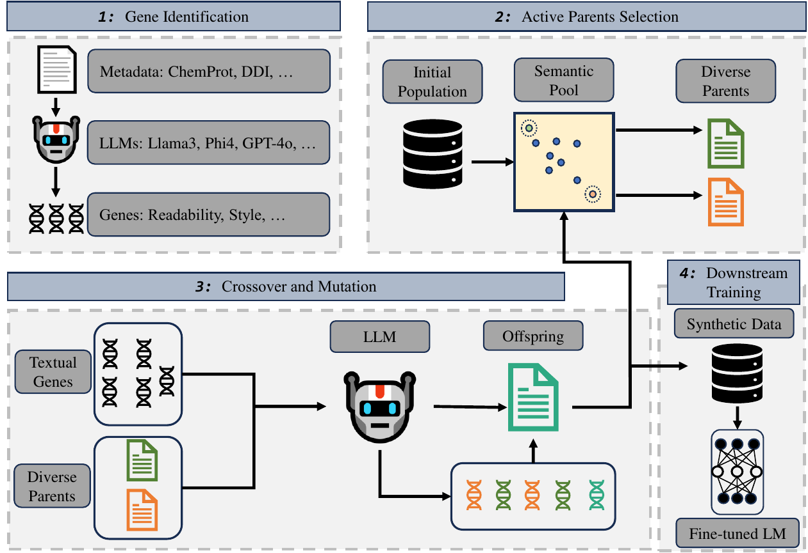

## Genetic Prompt （EMNLP2025）
This repo contains the code for paper [Attributes as Textual Genes: Leveraging LLMs as Genetic Algorithm Simulators for Conditional Synthetic Data Generation](https://arxiv.org/abs/2509.02040), which will appear at Findings of EMNLP 2025. 

## Framework


## Environment

`conda env create -f environment.yml`

`conda activate SDG`

## Dataset

We use eight datasets covering diverse domains and tasks.  
We also provide preprocessing scripts in `/Data-preprocess` to convert the raw data into expected format.

| Dataset | Domain | Task | Download |
|----------|---------|-------|-----------|
| AG News | News | Classification (CLS) | [Link](https://huggingface.co/datasets/yyu/agnews-attrprompt) |
| StackExchange | Science | Classification (CLS) | [Link](https://huggingface.co/datasets/yyu/stackexchange-attrprompt) |
| ChemProt | Biomedicine | Relation Extraction (RE) | [Link](https://huggingface.co/datasets/AdaptLLM/ChemProt) |
| DDI | Pharmacology | Relation Extraction (RE) | [Link](https://github.com/isegura/DDICorpus) |
| SemEval | Web | Relation Extraction (RE) | [Link](https://huggingface.co/datasets/SemEvalWorkshop/sem_eval_2010_task_8) |
| CoNLL04 | News | Relation Extraction (RE) | [Link](https://huggingface.co/datasets/DFKI-SLT/conll04) |
| SciTLDR | Science | Abstractive Summarization (ABS) | [Link](https://github.com/allenai/scitldr/tree/master/SciTLDR-Data) |
| MeQSum | Medical | Abstractive Summarization (ABS) | [Link](https://github.com/abachaa/MeQSum) |

## Synthetic Data Generation

See `/Generation` and `/Generation-scripts` for details.

## Downstream Model Training

See `/Downstream` and `/Downstream-scripts` for details.

## Contact
Feel free to contact ghan AT memphis DOT edu for any questions and collaboration opportunities.

## Citation
If you find this repository helpful, please kindly consider citing the corresponding paper. Thanks in advance!

```
@inproceedings{han2025attributes,
    title = "Attributes as Textual Genes: Leveraging {LLM}s as Genetic Algorithm Simulators for Conditional Synthetic Data Generation",
    author = "Han, Guangzeng  and
      Liu, Weisi  and
      Huang, Xiaolei",
    editor = "Christodoulopoulos, Christos  and
      Chakraborty, Tanmoy  and
      Rose, Carolyn  and
      Peng, Violet",
    booktitle = "Findings of the Association for Computational Linguistics: EMNLP 2025",
    month = nov,
    year = "2025",
    address = "Suzhou, China",
    publisher = "Association for Computational Linguistics",
    url = "https://aclanthology.org/2025.findings-emnlp.1055/",
    pages = "19367--19389",
    ISBN = "979-8-89176-335-7"
}
```

## Acknowledgement

Inspired by and partly based on [AttrPrompt](https://github.com/yueyu1030/AttrPrompt). Thanks to the authors for open-sourcing it.


